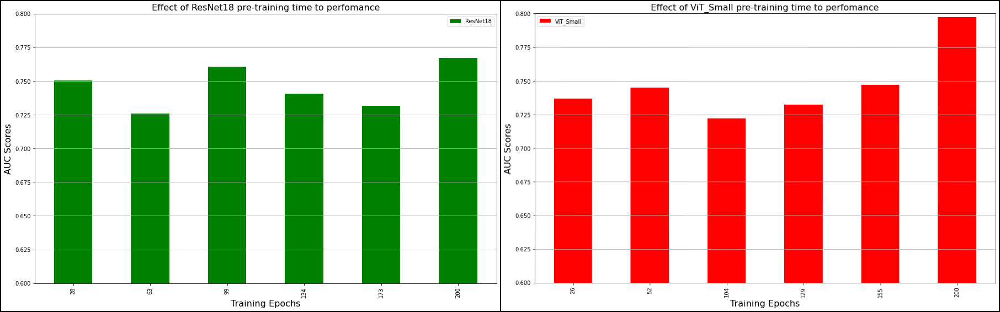

**What is the effect of _ImageNet_ initialization and does the patch size has an effect on it?** 
-We state the significant performance increase (0.834 to 0.917) on the **ViT_Small** backbones when we initialize it with _ImageNet_ weights before the SSL pre-training, but very small on **ResNet18**. And increasing the patch size from 224 to 256 influences negatively **ResNet18**. But has positive effects on **ViT_Small** which is surprising because the _ImageNet_ weights originally came from a model that trained on the images of size 224x224. The next graph represents the AUC scores of the two backbones initialized with ImageNet or random weights at different image resolutions 224x224 pixels and 256x256 pixels: 

**Is it worth doing long SSL training?**
- Next plots demonstrate the pre-training time of the _Backbone_ to the performance of the pipeline, where each 26 _epochs_ for **ViT_Small** takes and each 35 _epochs_ for **ResNet18** takes 12 hours. And we see that longer training improves the final performance and stabilizes the backbone. On the other hand, short training as well achieves comparable results to long ones. Especially, it's the case for __ResNet18__, with only 12 hours of training it gets very similar results to 72 hours.

